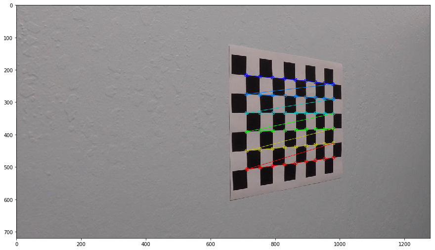
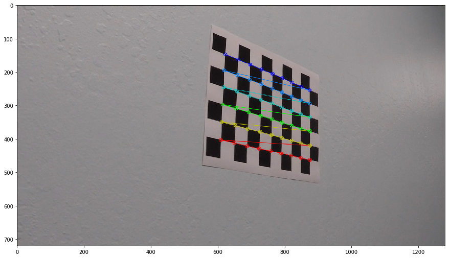
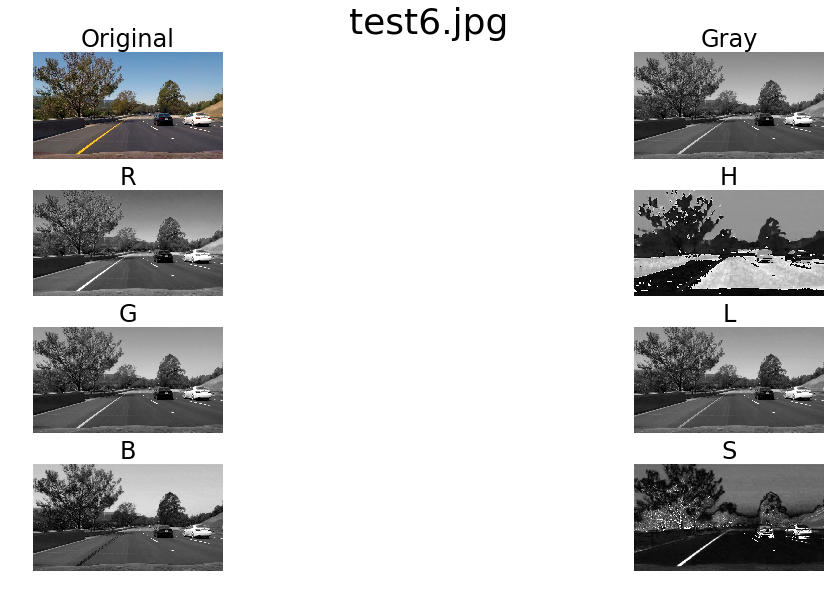
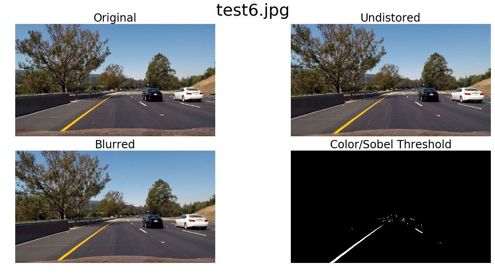
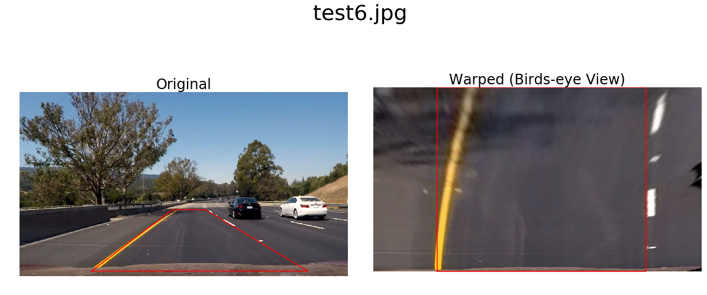

# Advanced Lane Finding

# Overview
In this project, I will write a software pipeline to identify the lane boundaries in a video from a front-facing camera on a car. The camera calibration images, test road images, and project videos are available in the project repository.

The complete pipeline can be found [here](./advanced_land_finding.ipynb).

# The Project

The goals / steps of this project are the following:

* Compute the camera calibration matrix and distortion coefficients given a set of chessboard images.
* Apply a distortion correction to raw images.
* Use color transforms, gradients, etc., to create a thresholded binary image.
* Apply a perspective transform to rectify binary image ("birds-eye view").
* Detect lane pixels and fit to find the lane boundary.
* Determine the curvature of the lane and vehicle position with respect to center.
* Warp the detected lane boundaries back onto the original image.
* Output visual display of the lane boundaries and numerical estimation of lane curvature and vehicle position.

## Initialization: Import and initialize the packages needed in the projects

* OpenCV - an open source computer vision library,
* Matplotbib - a python 2D plotting libray,
* Numpy - a package for scientific computing with Python,
* MoviePy - a Python module for video editing.

## Step 1: Compute the camera calibration using chessboard images
The next step is to perform a camera calibration. A set of chessboard images will be used for this purpose.

The camera_calibration function takes as input parameters an array of paths to chessboards images, and the number of inside corners in the x and y axis.

For each image path, calibrate_camera:

reads the image by using the OpenCV cv2.imread function,
converts it to grayscale usign cv2.cvtColor,
find the chessboard corners usign cv2.findChessboardCorners
Finally, the function uses all the chessboard corners to calibrate the camera by invoking cv2.calibrateCamera.

The values returned by cv2.calibrateCamera will be used later to undistort our video images.

## Step 2: Apply a distortion correction to raw images
Another OpenCv funtion, cv2.undistort, will be used to undistort images.

Below, it can be observed the result of undistorting one of the chessboard images:

## Step 3: Use color transforms, gradients, etc., to create a thresholded binary image.
Different color space configurations of challenging frames

 
As we can see the lanes lines in the challenge and harder challenge videos were extremely difficult to detect. They were either too bright or too dull. So the get_thresholded_image functionThis use R & G channel thresholding and L channel thresholding

An in-depth explanation about how these functions work can be found at the Lesson 15: Advanced Techniques for Lane Finding of Udacity's Self Driving Car Engineer Nanodegree.

## Step 4: Apply a perspective transform to rectify binary image ("birds-eye view").
The next step in our pipeline is to transform our sample image to birds-eye view.

The process to do that is quite simple:

First, you need to select the coordinates corresponding to a trapezoid in the image, but which would look like a rectangle from birds_eye view.
Then, you have to define the destination coordinates, or how that trapezoid would look from birds_eye view.
Finally, Opencv function cv2.getPerspectiveTransform will be used to calculate both, the perpective transform M and the inverse perpective transform _Minv.
M and Minv will be used respectively to warp and unwarp the video images.
Please find below the result of warping an image after transforming its perpective to birds-eye view: 

